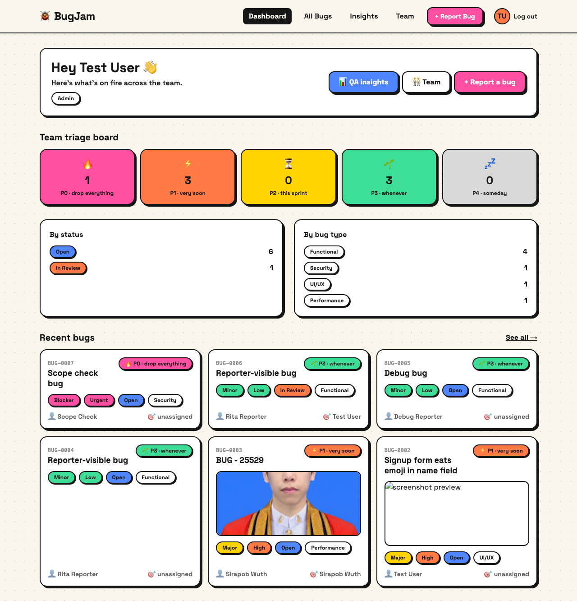
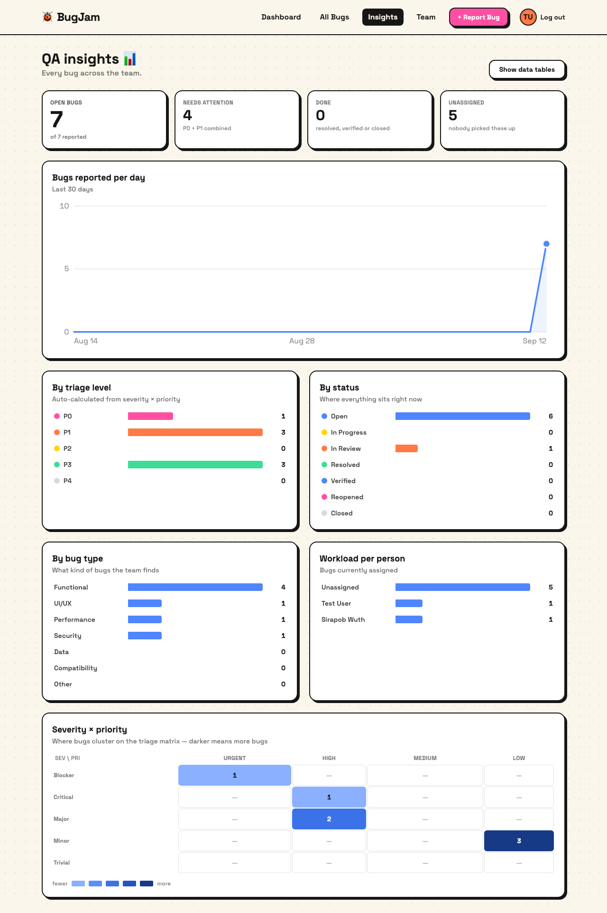
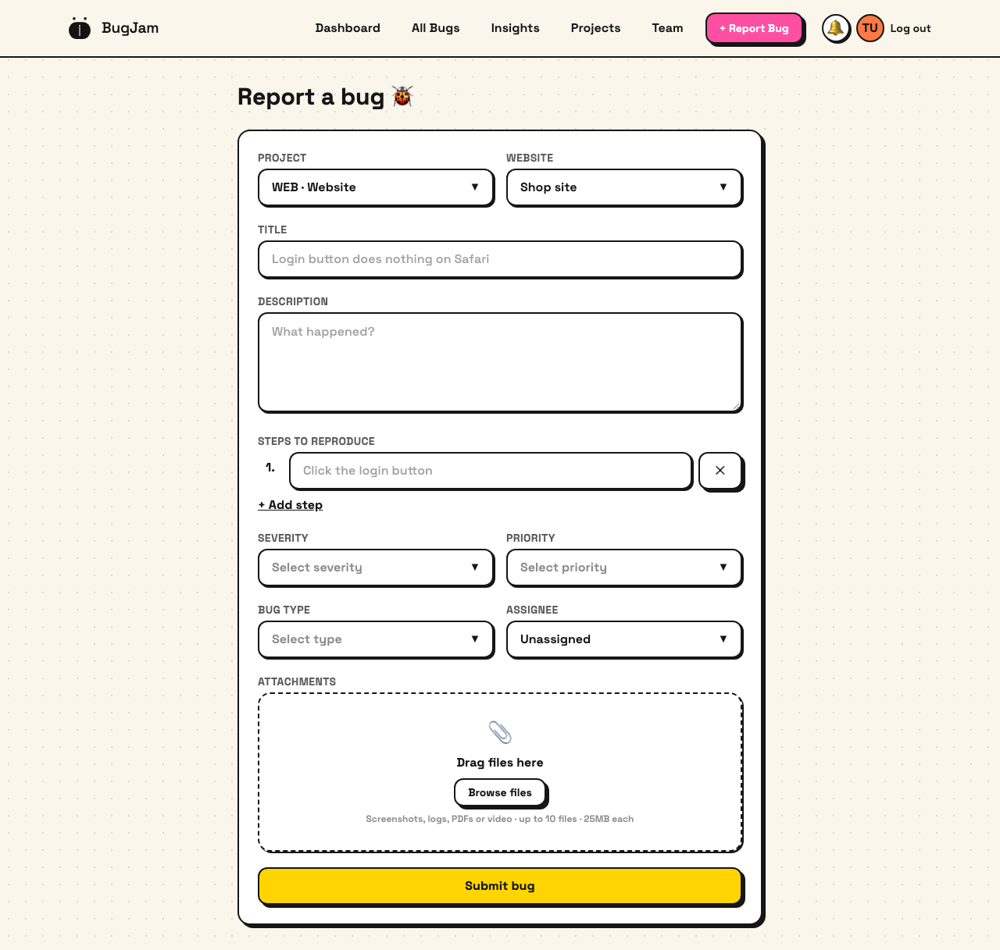
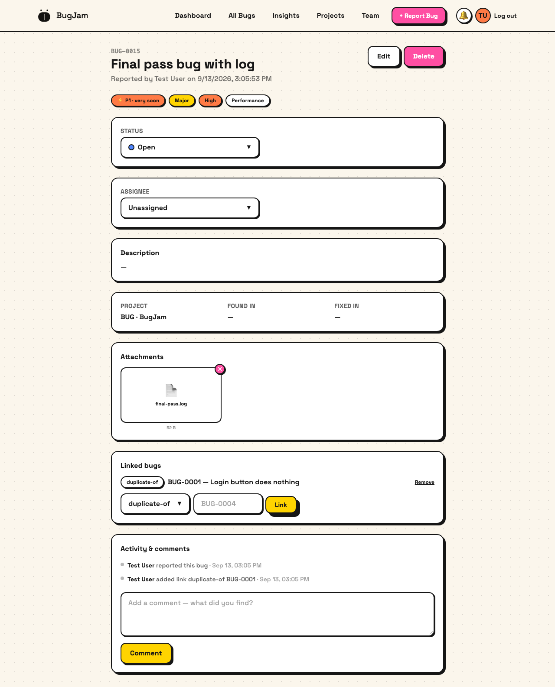

# BugJam

A bug-tracking web app: report bugs with attachments, auto-triage priority, discuss them on a
timeline, and see where the team stands.

- **Frontend**: Vue 3 + Vite + Tailwind CSS
- **Backend**: Express.js REST API
- **Database**: MongoDB (via Mongoose)
- **File storage**: MinIO (images, logs, PDFs, video)
- **Tests**: Vitest + Supertest (`npm test` in `backend/`)

**Features**: projects with their own bug-id sequence, site/app list and version list · severity ×
priority auto-triage · comments and a full activity history per bug · in-app notifications ·
duplicate/blocks links between bugs · filters, search, sorting, pagination, bulk actions and CSV
export · a charts dashboard for QA leads · role-based access.

| | |
|---|---|
|  |  |
| **Dashboard** — triage board, click a level to filter | **QA insights** — charts, every row drills into the list |
|  |  |
| **Report a bug** — project picks the site/app list | **Bug detail** — attachments, links, timeline |

## Project structure

```
backend/           Express API — src/{models,controllers,routes,services,middleware,config}
  tests/           Vitest + Supertest suites
frontend/          Vue 3 + Vite — src/{views,components,stores,utils}
docs/design/       logo handoff the brand mark was built from
docs/screenshots/  images used in this README
docker-compose.yml MongoDB + MinIO for local development
```

## Auto-calculated triage level

Every bug's **Priority Level (P0–P4)** is computed automatically from Severity × Priority — see
`backend/src/utils/priorityMatrix.js`. `bugType` (Functional/UI/Performance/...) stays a manual field.

| Severity \ Priority | Urgent | High | Medium | Low |
|---|---|---|---|---|
| Blocker  | P0 | P0 | P1 | P1 |
| Critical | P0 | P1 | P1 | P2 |
| Major    | P1 | P1 | P2 | P2 |
| Minor    | P2 | P2 | P3 | P3 |
| Trivial  | P3 | P3 | P4 | P4 |

## Roles & permissions

`Reporter` (default) · `Developer` · `Head of QA` · `Admin`

The **first account to register becomes `Admin`**; everyone after defaults to `Reporter`. If a database
somehow ends up with no elevated user, the oldest account is promoted to `Admin` on server start
(`backend/src/config/bootstrapAdmin.js`) so the app can never lock itself out. Elevated users change
anyone's role from the **Team** page.

| Action | Reporter / Developer | Head of QA / Admin |
|---|---|---|
| Report a bug | ✅ | ✅ |
| See bugs | only ones they reported or are assigned to | all bugs, team-wide |
| Set status Open → In Progress → In Review → Resolved / Closed | ✅ on their own bugs | ✅ any bug |
| Set status **Verified** / **Reopened** | ❌ | ✅ |
| Reassign a bug | ❌ | ✅ |
| Delete a bug | ❌ | ✅ |
| Comment on a bug they can see | ✅ | ✅ |
| Link bugs (duplicate / blocks / relates-to) | ✅ on their own bugs | ✅ any bug |
| Bulk actions & CSV export | ❌ (export is scoped to their own bugs) | ✅ |
| Manage users, roles & password resets | ❌ | ✅ |
| Manage projects & versions | ❌ | ✅ |
| QA insights dashboard (charts) | ❌ | ✅ |

## Projects & bug ids

Every bug belongs to a project, and ids are sequential **per project** (`WEB-0001`, `MOB-0001`).
A project's key is fixed once created because it is baked into every id already issued. Bugs that
predate projects are moved into a default `BUG` project on startup
(`backend/src/config/bootstrapProject.js`), which keeps their original `BUG-000n` ids valid.

## Testing

```
cd backend
npm test          # vitest run
```

Tests hit a real MongoDB (`bugtracker_vitest` on the Docker instance, dropped afterwards), so
`docker compose up -d` must be running. MinIO is swapped for a stub via an alias in
`vitest.config.js`, so no object storage is needed.

## Brand assets

Built from `docs/design/bugjam-logo/` (geometry verified pixel-for-pixel against the design reference).

| File | Use |
|---|---|
| `frontend/src/components/BugJamMark.vue` | the mark as a Vue component (`size` + `color` props) |
| `frontend/public/bugjam-mark.svg` | standalone mark, `currentColor` so it can be recolored |
| `frontend/public/favicon.svg` | primary treatment (cream mark on `#141311`) for browser tabs |
| `frontend/public/favicon.ico` | 16 / 32 / 48 bundle |
| `frontend/public/favicon-{16,32,48}.png`, `apple-touch-icon.png`, `icon-512.png` | raster exports |

The mark ships only in its two approved treatments — cream `#EFE7D6` on ink `#141311`, or the reverse
(`brandink` / `brandcream` in `tailwind.config.js`). At 16px the seam is dropped per the handoff's
small-size note. Nav lockup follows the handoff: mark 28px, 14px gap, wordmark 19px/500/−0.01em.

## Running locally

0. **Set the MinIO credentials** — copy `.env.example` to `.env` at the repo root and pick a user
   and password. Docker Compose reads them from there; they are never committed.

1. **Start MongoDB + MinIO**
   ```
   docker compose up -d
   ```
   MinIO console: http://localhost:9001 (sign in with the credentials you just set)

2. **Backend**
   ```
   cd backend
   cp .env.example .env
   npm install
   npm run dev
   ```
   Runs on http://localhost:4000

3. **Frontend**
   ```
   cd frontend
   npm install
   npm run dev
   ```
   Runs on http://localhost:5173 (proxies `/api` to the backend)

4. Open http://localhost:5173, register an account, and start logging bugs. The first account
   registered becomes the Admin.

### Opening it from another device on the same Wi-Fi

The Vite dev server already binds every interface. Set `MINIO_ENDPOINT` in `backend/.env` to your
machine's LAN IP first — attachment URLs are signed against that host, so `localhost` would break
images on the other device. Then browse to `http://<your-ip>:5173`.